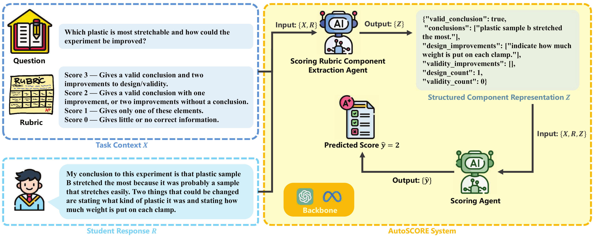

# AutoSCORE: Enhancing Automated Scoring with Multi-Agent LLMs via Structured Component Recognition (EAAI 2026)

This repository provides the implementation and resources for the paper *"AutoSCORE: Enhancing Automated Scoring with Multi-Agent Large Language Models via Structured Component Recognition"*, published at *AAAI / EAAI 2026*. 

**AutoSCORE Paper:** [Preprint](https://arxiv.org/pdf/2509.21910), [Official](https://ojs.aaai.org/index.php/AAAI/article/view/42123)

## Overview
AutoSCORE is a rubric-aligned, multi-agent LLM framework designed to enhance automated scoring of student responses. It consists of two cooperating agents: a Scoring Rubric Component Extraction Agent that identifies rubric-relevant evidence and encodes it into structured representations, and a Scoring Agent that predicts scores based on these components. This design bridges the gap between language model reasoning and human rubric-based grading. We conduct experiments on four public datasets from the ASAP suite using multiple LLMs (GPT-4o, LLaMA-8B, LLaMA-70B). Results demonstrate that AutoSCORE achieves superior reliability and validity across scoring tasks, improving interpretability, robustness, and scalability compared to single-agent baselines.

## AutoSCORE Framework
<p align="center">
  
</p>

Overview of the proposed AutoSCORE multi-agent framework. The Scoring Rubric Component Extraction Agent
identifies rubric-aligned components from the task context and student response, producing a structured representation Z. The
Scoring Agent leveraged this representation together with the original inputs to assign the final score.

## Repository Structure

```
├── asap_sas_multi_agent_gpt4o.py      # Multi-agent SAS scoring system using GPT-4o (ASAP-SAS2 as example)
├── asap_sas_multi_agent_llama70b.py   # Multi-agent SAS scoring system using Llama 70B (ASAP-SAS2 as example)
├── asap_sas_single_agent_gpt4o.py     # Single-agent SAS scoring system using GPT-4 (ASAP-SAS2 as example)
├── asap_sas_single_agent_llama70b.py  # Single-agent SAS scoring system using Llama 70B (ASAP-SAS2 as example)
├── requirements.txt                   # Dependencies
├── datasets/                          # Dataset directory
│   ├── ASAP-AES/                      # Essay scoring dataset (100 examples)
│   └── ASAP-SAS/                      # Short answer scoring dataset (100 examples x 3 subsets)
├── outputs/                           # Output results directory
│   ├── ASAP-AES/
│   └── ASAP-SAS/
├── prompts/                           # Prompt template directory
│   ├── ASAP-AES/
│   └── ASAP-SAS/
└── utils/                             # Utility functions
    └── metrics.py                     # Evaluation metrics implementation
```

## Requirements

- Python 3.10
- Dependencies (see requirements.txt)


## Installation

1. Clone the repository:
```bash
git clone https://github.com/AI4STEM-Education-Center/AutoSCORE.git
cd AutoSCORE
```

2. Install dependencies:
```bash
pip install -r requirements.txt
```

## Usage

The data processing and scoring procedures are highly similar across all datasets. Therefore, we present **ASAP-SAS2** as an example in the usage instructions below. All prompt templates used in our experiments are publicly available in the `prompts/` directory. The framework can be easily adapted to other datasets by modifying the component extraction logic in the corresponding scripts.

### Single-Agent Scoring System

Using GPT-4:
```bash
python asap_sas_single_agent_gpt4o.py
```

Using Llama 70B:
```bash
python asap_sas_single_agent_llama70b.py
```

### Multi-Agent Scoring System

Using GPT-4:
```bash
python asap_sas_multi_agent_gpt4o.py
```

Using Llama 70B:
```bash
python asap_sas_multi_agent_llama70b.py
```


## Citation

If you find this repo useful, please star our project and cite our paper.
```bibtex
@inproceedings{wang2026autoscore,
  title={Autoscore: Enhancing automated scoring with multi-agent large language models via structured component recognition},
  author={Wang, Yun and Ding, Zhaojun and Wu, Xuansheng and Sun, Siyue and Liu, Ninghao and Zhai, Xiaoming},
  booktitle={Proceedings of the AAAI Conference on Artificial Intelligence},
  volume={40},
  number={48},
  pages={40898--40906},
  year={2026}
}
```

## Acknowledgement

This work is supported by the National Science Foundation
(NSF) under Grant Nos. 2507128 and 2101104, and by
the Institute of Education Sciences (IES) under Grant No.
R305C240010. The views and conclusions expressed in this
paper are those of the authors and do not necessarily reflect
the views of the funding agencies.
